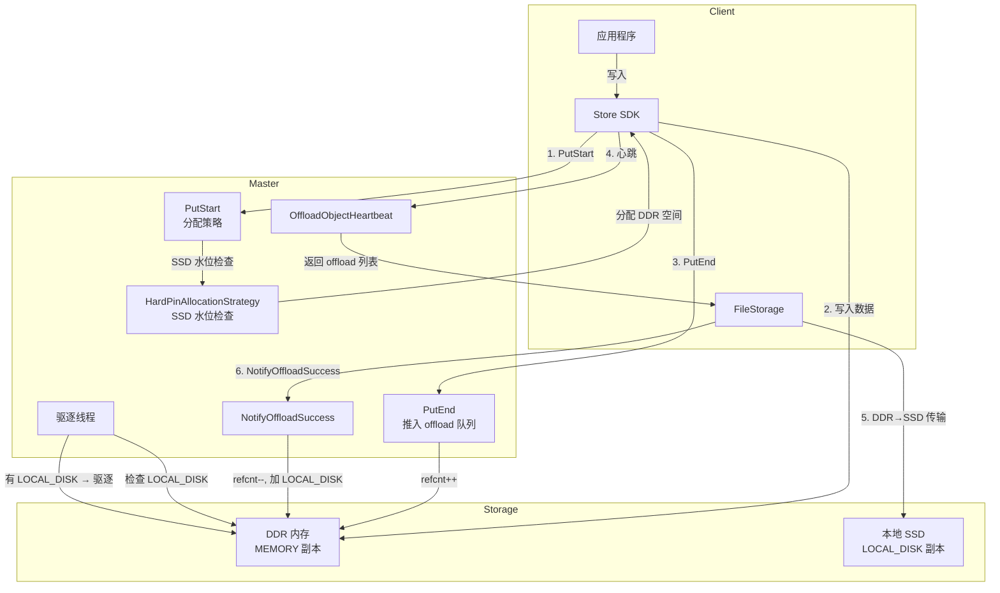
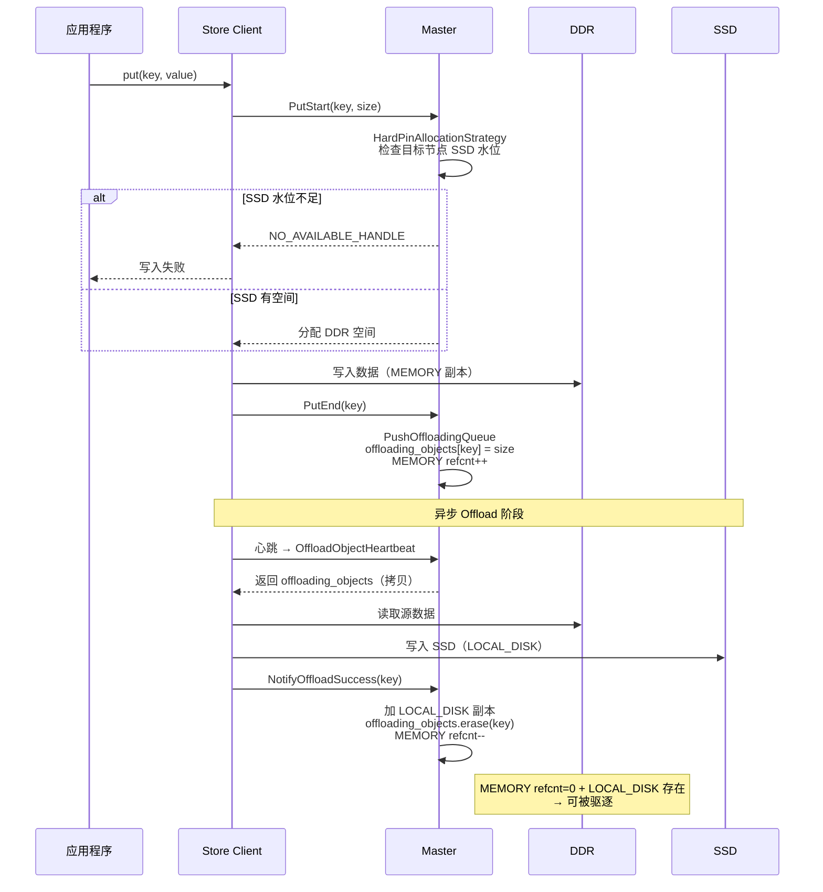
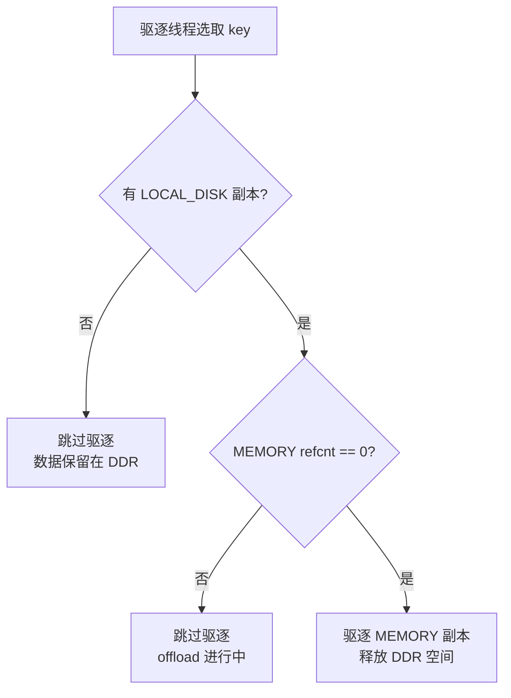
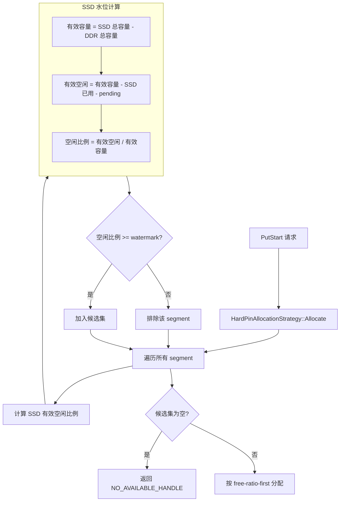
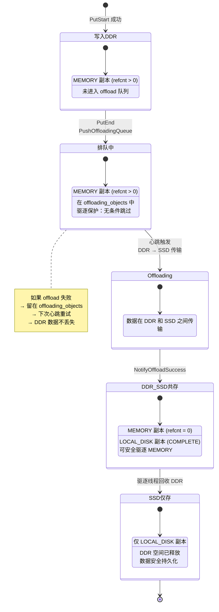
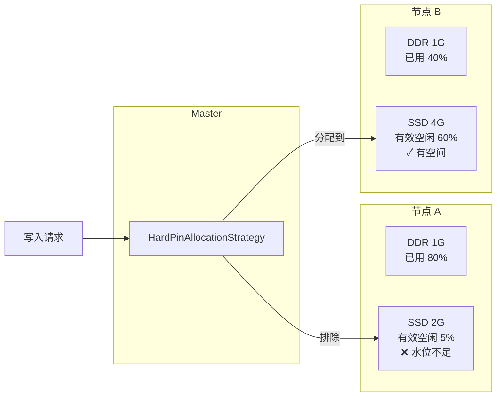
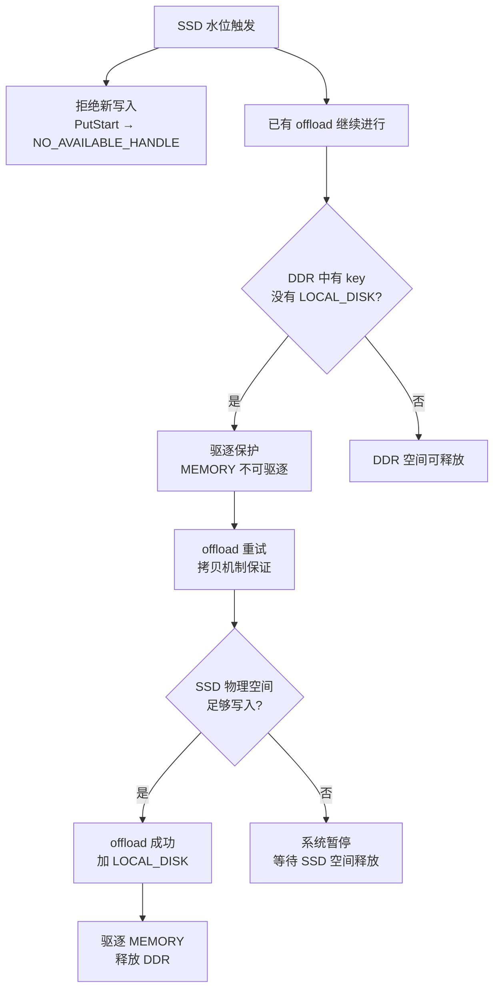

# HardPin 分配策略设计文档

## 1. 概述

HardPin 是 Mooncake Store 的一种存储分配策略，核心目标：

- **数据安全**：SSD 数据在任何情况下不被驱逐
- **SSD 全量备份**：每个写入 DDR 的 key 最终必须出现在 SSD 中
- **负载均衡**：SSD 快满的节点不再接收新写入，写入落到有空闲 SSD 的节点

### 适用场景

- 数据可靠性要求高，不允许 SSD 数据丢失
- 每个节点同时提供 DDR（高速缓存）和 SSD（持久存储）
- 多节点集群需要基于 SSD 容量做负载均衡

### 配置要求

```bash
# Master 启动参数
--enable_offload=true
--allocation_strategy=hard_pin
--ssd_watermark_ratio=0.15     # SSD 有效空闲比例阈值

# Client 启动参数
enable_ssd_offload=True
ssd_offload_path=/path/to/ssd
```

不使用 `--offload_on_evict`（默认 false），即 PutEnd 后立即推入 offload 队列。

---

## 2. 架构总览



---

## 3. 数据写入与 Offload 流程



---

## 4. 三大核心机制

### 4.1 无条件驱逐保护

驱逐线程遍历 key 时，**只要没有 LOCAL_DISK 副本，MEMORY 副本就不能被驱逐**。不检查 SSD 水位、不检查 refcnt。



### 4.2 SSD 水位分配控制

PutStart 分配时，检查目标节点的 SSD 有效空闲比例。有效容量预留了 DDR 总容量，确保 SSD 物理上始终能容纳 DDR 全量数据。



**举例**（DDR 1G, SSD 2G, watermark 0.15）：

| SSD 已用 | 有效容量 | 有效空闲 | 空闲比例 | 结果 |
|----------|---------|---------|---------|------|
| 0.5G | 1G | 0.5G | 50% | 允许分配 |
| 0.85G | 1G | 0.15G | 15% | 刚好到水位线 |
| 0.9G | 1G | 0.1G | 10% | 拒绝分配 |

水位触发时 SSD 物理剩余 = 2G - 0.85G = **1.15G**，足以容纳 DDR 全量数据（≤1G）。

### 4.3 Offload 失败重试

`OffloadObjectHeartbeat` 返回 `offloading_objects` 的**拷贝**（非 move），失败的 key 保留在 map 中供下次心跳重试。

```mermaid
flowchart TD
    HB[客户端心跳] --> OOH[OffloadObjectHeartbeat]
    OOH --> COPY[返回 offloading_objects 拷贝<br/>原 map 保留]
    COPY --> OFFLOAD[客户端执行 offload]
    OFFLOAD --> RESULT{offload 结果}
    RESULT -->|成功| NOS[NotifyOffloadSuccess]
    NOS --> ERASE[offloading_objects.erase(key)]
    NOS --> REFCNT[MEMORY refcnt--]
    RESULT -->|失败| RETRY[key 留在 offloading_objects<br/>下次心跳重试]
```

---

## 5. DDR-SSD 数据流转全貌



---

## 6. 多节点负载均衡



关键行为：
- 每个 segment 独立计算 SSD 水位
- SSD 满的节点被排除，不参与分配
- 新写入自动落到有空闲 SSD 的节点
- 所有节点 SSD 都满时 → 全局拒绝写入

---

## 7. SSD 满时的系统行为



**关键保证**：保守预留策略（`有效容量 = SSD总容量 - DDR总容量`）确保水位触发时，SSD 物理剩余空间 ≥ DDR 总容量，足以容纳所有待 offload 的数据。

---

## 8. 配置参数参考

| 参数 | 默认值 | 说明 |
|------|--------|------|
| `--allocation_strategy` | random | 设为 `hard_pin` 启用本策略 |
| `--enable_offload` | false | 必须设为 true |
| `--ssd_watermark_ratio` | 0.15 | SSD 有效空闲比例阈值 |
| `--offload_on_evict` | false | 建议保持 false（PutEnd 立即 offload） |
| `--eviction_high_watermark_ratio` | 0.95 | DDR 驱逐触发水位 |
| `--port` | 50051 | Master RPC 端口 |
| `--http_metadata_server_port` | 8080 | HTTP 元数据端口 |
| `--metrics_port` | 9003 | 指标端口 |

---

## 9. 故障场景分析

| 场景 | 系统行为 | 数据是否安全 |
|------|---------|-------------|
| DDR 满，SSD 有空间 | 驱逐无 LOCAL_DISK 的 key 被阻止，等待 offload | ✓ 安全 |
| SSD 水位触发 | 拒绝新写入，已有 offload 继续 | ✓ 安全 |
| Offload 传输失败 | key 留在 offloading_objects，下次心跳重试 | ✓ 安全 |
| 所有节点 SSD 满 | 全局拒绝写入，系统暂停 | ✓ 安全 |
| 单节点 SSD 物理满 | 该节点 offload 失败重试，DDR 数据被保护不驱逐 | ✓ 安全 |
| Master 重启 | 元数据恢复，offloading_tasks 丢失但驱逐保护仍在 | ✓ DDR 数据安全 |

---

## 10. 限制与注意事项

1. **SSD 容量必须大于 DDR 容量**：否则有效容量 ≤ 0，无法分配
2. **写入速度受 offload 速度限制**：DDR 填满后，写入吞吐取决于 DDR→SSD 的传输速率
3. **offloading_tasks 超时（600s）**：任务超时后 refcnt 归零，但驱逐保护仍会阻止驱逐（无 LOCAL_DISK 的 key 不会被驱逐），数据不会丢
4. **不支持 SSD 数据驱逐**：HardPin 模式下 `BatchEvictDiskReplica(LOCAL_DISK)` 无条件拒绝，存储后端内部 LRU 驱逐被阻止
